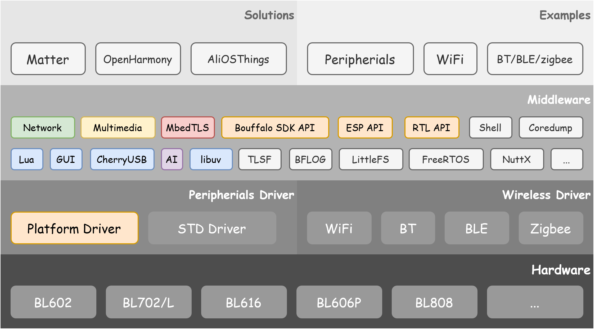

[](LICENSE)

[中文版](README_zh.md)

# Introduction

**BouffaloSDK** is an MCU software development kit provided by the Bouffalo Lab Team, supports all the series of Bouffalo chips.

# SDK Architecture



# Code Directories

| Name | Description |
|:---:|:------:|
| bsp/board |  clock, pinmux, memoryheap and console init |
| bsp/common | bsp common driver|
| components| components|
|docs | quick start、 api、demo doc|
|drivers/lhal| bouffalo common peripherals drivers which support all the chips|
|drivers/soc| bouffalo non-generic peripherals drivers|
|drivers/rfparam| rf param |
|examples| official samples|
|tools| tools |

# LHAL Support

**LHAL** is a low level hal driver for common peripherals designed by Bouffalo Lab, in order to support all the Bouffalo chips with the same api . Also it is convenient for users to use and port to other platforms.

Note：**√** means supported ; **×** means not supported; **○** means supported but not tested ; **-** means no such peripheral.

|   Peripheral |    BL602/BL604 |    BL702/BL704/BL706 | BL616/BL618 |   BL808  |
|:------------:|:--------------:|:--------------------:|:-----------:|:--------:|
|  ADC         |      ○         |      √             |   √           |   ○      |
|  CAM         |      -         |      ×             |   ×           |   ×      |
|  CKS         |      ○         |      √             |   √           |   ○      |
|  DAC         |      ○         |      √             |   √           |   ○      |
|  DMA         |      ○         |      √             |   √           |   √      |
|  EFUSE       |      ×         |      ×             |   ×           |   ×      |
|  EMAC        |      -         |      √             |   √           |   √      |
|  FLASH       |      √         |      √             |   √           |   √      |
|  GPIO        |      ○         |      √             |   √           |   √      |
|  I2C         |      ○         |      √             |   √           |   ○      |
|  I2S         |      ○         |      ○             |   √           |   ○      |
|  IR          |      ○         |      √             |   √           |   ○      |
|  MJPEG       |      ×         |      ×             |   √           |   √      |
|  PWM_v1      |      ○         |      √             |   -           |   -      |
|  PWM_v2      |      -         |      -             |   √           |   √      |
|  RTC         |      ○         |      √             |   √           |   √      |
|  SEC_AES     |      ○         |      √             |   √           |   √      |
|  SEC_SHA     |      ○         |      √             |   √           |   √      |
|  SEC_TRNG    |      ○         |      √             |   √           |   √      |
|  SEC_PKA     |      ○         |      √             |   √           |   √      |
|  SPI         |      ○         |      √             |   √           |   √      |
|  TIMER       |      ○         |      √             |   √           |   √      |
|  UART        |      √         |      √             |   √           |   √      |
|  USB_v1      |      -         |      √             |   -           |   -      |
|  USB_v2      |      -         |      -             |   √           |   √      |
|  WDG         |      ○         |      √             |   √           |   ○      |

# Environment Setup

## Toolchain

- [riscv64-unknown-elf-gcc](https://gitee.com/bouffalolab/toolchain_gcc_t-head_windows) toolchain used in windows.
- [riscv64-unknown-elf-gcc](https://gitee.com/bouffalolab/toolchain_gcc_t-head_linux) toolchain used in linux.
- [linux-riscv64-linux-gcc](https://gitee.com/bouffalolab/linuxtoolchain_gcc_t-head) toolchain used for compiling linux code.

## Command Line Development

Before compiling with the command line, you need to select the corresponding toolchain according to your operating system, configure it to the system environment variables, and install the **make** or **ninja**, then you can do the following. For the details, you can visit [BouffaloSDK Environment Setup](https://bl-mcu-sdk.readthedocs.io/zh_CN/latest/get_started/index.html).

- Go to the demo directory where you want to compile and there are `main.c` and `Makefile` files in that directory
- Just execute the following command, take **BL616** as an example

```
cd examples/helloworld
make CHIP=bl616 BOARD=bl616dk
```

- If you use **BL808** or **BL606P**, you need to add **CPU_ID** with m0 or d0.

If you want to use **ninja**, you can try:

```
cd examples/helloworld
make ninja CHIP=bl616 BOARD=bl616dk
```

```
cd examples/helloworld
make CHIP=bl808 BOARD=bl808dk CPU_ID=m0
```

## CDK Development

TODO

## Debug

Only supports debug with CKLink currently. See [BouffaloSDK Debug Guide](https://bl-mcu-sdk.readthedocs.io/zh_CN/latest/get_started/debug.html).

## Firmware Download

Note that if you are using linux, linux will deny access to the serial device due to permission issues, so add your own username to `dialout` for easy to use, restart your linux and then take effect. Or add `sudo` before command.

```
usermod -aG dialout xxx # xxx is your own name
```

```
cd examples/helloworld
make flash CHIP=chip_name COMX=xxx # chip_name should be bl602/bl702/bl616/bl808/bl606p, COMX in Windows, /dev/ttyxxx in Linux
```

- If you use **BL808** or **BL606P**, you need to add **CPU_ID** with m0 or d0.

```
cd examples/helloworld
make flash CHIP=chip_name CPU_ID=m0 COMX=xxx # chip_name should be bl602/bl702/bl616/bl808/bl606p, COMX in Windows, /dev/ttyxxx in Linux
```

If flash using serial port rather than USB, different USB2TTL chips support different max baudrates, need to pay attention to when flashing.

| chip | baudrate|
|:---:|:------:|
| ch340 |  <= 500K |
| cp2102 |  <= 2M |
| ft232 |  <= 2M |
| bl702 |  <= 8M |
| bl616 |  <= 10M |

# Resources

## Chip Manual

**Chip Reference Manual** and **Chip Data Manual** are listed on [document](https://dev.bouffalolab.com/document)

## Documentation Tutorial

To get more BouffaloSDK documentation tutorial, like api manual or peripheral demo and so on, please visit:

- [BouffaloSDK documentation tutorial](https://bl-mcu-sdk.readthedocs.io/zh_CN/latest/)

## Video Tutorial

TODO

## Forum

Bouffalolab Developer Forum: [https://bbs.bouffalolab.com/](https://bbs.bouffalolab.com/)